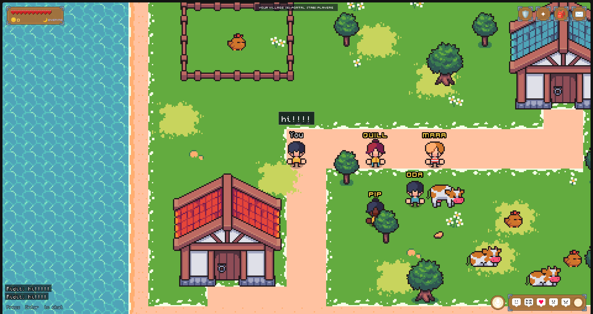

<div align="center">

# Pixl: The Game

**A pixelated multiplayer world where you level up by shipping IRL projects.**

[](https://www.typescriptlang.org/)
[](https://phaser.io/)
[](https://bun.sh/)
[](https://socket.io/)
[](https://vitejs.dev/)
[](https://hackclub.com/)
[](LICENSE)
[](https://github.com/Pixl-YSWS/Game/stargazers)
[](https://github.com/Pixl-YSWS/Game/forks)

[**▶ Play Now**](https://play.pixl.rsvp) · [RSVP](https://pixl.rsvp) · [Report a Bug](https://github.com/Pixl-YSWS/Game/issues) · [Request a Feature](https://github.com/Pixl-YSWS/Game/issues)

</div>

---

## About

**Pixl** Pixl is a pixel-themed [YSWS](https://hackclub.com) where you evolve in a retro 2D open world and level up by building real projects. By exploring the map, you will discover different regions such as a cyberpunk city, an underwater region or even a gambling one. Each region will have sidequests like making apps, websites, or hardware for in-game characters that will pay you. You can also make regular software and hardware projects in your main village and sell them to merchants. Earn pixels, the in-game currency to buy nice items in the shop, or unlock funding. The more pixels you get, the best regions you can unlock and the more pixels you will get from the merchants.

- **Shared open world** — explore with other Hack Clubbers in real time
- **Private village** — your own procedurally generated space, seeded from your account
- **Shop & economy** — spend Pixels on a shop to get prizes (mainly grants as we know you love that)
- **Custom skins** — draw your own 16×16 pixel avatar --- WILL BE ADDED LATER
- **Chat & voice** — communicate with nearby players
- **Project submissions** — ship projects via the in-game **Pip** NPC
- **Hackatime integration** — coding time is automatically tracked and rewarded

---

## Screenshots

> _Screenshots coming soon — add yours by opening a PR!_

<table>
  <tr>
    <td align="center">
      <br/>
      <sub><b>Open World</b></sub>
    </td>
    <td align="center">
      <br/>
      <sub><b>Your Private Village</b></sub>
    </td>
  </tr>
  <tr>
    <td align="center">
      <br/>
      <sub><b>In-Game Shop</b></sub>
    </td>
    <td align="center">
      <br/>
      <sub><b>Custom Skin Editor</b></sub>
    </td>
  </tr>
</table>

---

## Features

### Multiplayer World
A real-time top-down world powered by Socket.IO. The shared **open world** uses a fixed seed (`0xC0FFEE`) so everyone sees the same landscape. Your **private village** is procedurally generated from your own account ID — unique to you, but visitable by others by inviting them.

### Consistency system
The more project you ship, the best merchants you unlock in your village, meaning that they will pay you more !

### Pixel Economy
Earn **Pixels** by shipping projects. Spend them in the shop on prizes. Prices are enforced server-side — no spoofing possible.

### Character Customisation
Choose from 5 preset character skins, or open the **Skin Editor** to draw a completely custom 16×16 avatar. Your skin is saved to your account and broadcast to all nearby players.

### Project Submissions (YSWS)
Talk to the **Pip** NPC in your village to submit projects with a name, description, repo URL, and demo link. Link your [Hackatime](https://hackatime.hackclub.com/) account to automatically sync coding time to your projects.

### Procedural Audio
An ambient music engine built entirely with the Web Audio API — no audio files needed. The musical scale shifts from major (day) to minor (night) in sync with the in-game day/night cycle.

### Map Authoring
Maps are created in [Tiled](https://www.mapeditor.org/) and exported to JSON. Run `bun run sync-map` to regenerate the TypeScript map data. Walkable tiles and solid decorations are preserved across syncs.

---

## Tech Stack

| Layer | Technology |
|---|---|
| Frontend | [Phaser 4](https://phaser.io/) + [TypeScript](https://www.typescriptlang.org/) |
| Build tool | [Vite 8](https://vitejs.dev/) |
| Runtime | [Bun](https://bun.sh/) |
| Server | [Express 5](https://expressjs.com/) + [Socket.IO 4](https://socket.io/) |
| Database | SQLite (via Bun's native driver) |
| Auth | [Hack Club OAuth](https://auth.hackclub.com/) |
| Map Editor | [Tiled](https://www.mapeditor.org/) |
| Coding Time | [Hackatime](https://hackatime.hackclub.com/) OAuth |

---

## Getting Started to use it locally (just go use it on [play.pixl.rsvp](https://play.pixl.rsvp) It's faster and better)

### Prerequisites

- [Bun](https://bun.sh/) `>= 1.x`
- A [Hack Club](https://hackclub.com/) account (required to log in)

### Installation

```bash
git clone https://github.com/Pixl-YSWS/Game.git
cd Game
bun install
```

### Configuration

```bash
cp .env.example .env
```

Fill in the required values in `.env`:

```env
# Required — register at https://auth.hackclub.com (Developer Apps → "app me up!")
# Add redirect URI: http://localhost:3001/auth/callback
# Request scopes: openid profile email name slack_id
HACKCLUB_CLIENT_ID=your_client_id
HACKCLUB_CLIENT_SECRET=your_client_secret

# Optional
ADMIN_SECRET=your_admin_secret          # Required for admin CLI
ADMIN_EMAILS=you@example.com            # Gets root admin on first login
DATA_DIR=./server/data                  # SQLite path (for prod/Railway)
ALLOW_GUEST=false                       # Allow unauthenticated access
OPENWORLD_VERIFIED_ONLY=false           # Restrict open world to verified users

# Optional — Hackatime OAuth integration
# Register at https://hackatime.hackclub.com/oauth/applications
# Redirect URI: http://localhost:3001/hackatime/callback  Scope: read
HACKATIME_CLIENT_ID=
HACKATIME_CLIENT_SECRET=
```

### Running Locally

The client and server must run **concurrently** in two separate terminals:

```bash
# Terminal 1 — Game server (Socket.IO on http://localhost:3001)
bun run server

# Terminal 2 — Vite dev server (http://localhost:5173)
bun run dev
```

Open [http://localhost:5173](http://localhost:5173) and click **Login with Hack Club**.

> **Note:** Login is mandatory. The socket server rejects any connection without a valid Hack Club session.

---

## Available Scripts

| Command | Description |
|---|---|
| `bun run dev` | Start the Vite dev server on `http://localhost:5173` |
| `bun run server` | Start the Socket.IO game server on `http://localhost:3001` (auto-reloads) |
| `bun run build` | Type-check and produce a production build (`tsc && vite build`) |
| `bun run preview` | Preview the production build locally |
| `bun run sync-map` | Sync a Tiled map export (`maps/map1.json`) → `src/data/MapData.ts` |

To override the server URL on the client side, set `VITE_SERVER_URL` in your environment.

---

## Project Structure

```
Game/
├── .github/workflows/      # CI/CD workflows
├── maps/                   # Tiled map exports (.json, .tsj)
├── public/
│   └── assets/             # Spritesheets, atlases, images
├── scripts/
│   └── sync-map.ts         # Map sync utility
├── server/
│   ├── admin-cli.ts        # Offline admin CLI
│   ├── auth.ts             # Hack Club OAuth & session management
│   ├── hackatime.ts        # Hackatime API integration
│   ├── hackatimeAuth.ts    # Hackatime OAuth flow
│   ├── index.ts            # Express + Socket.IO server entrypoint
│   └── data/
│       └── players.db      # SQLite database (gitignored)
├── src/
│   ├── audio/
│   │   ├── MusicEngine.ts  # Procedural ambient music (Web Audio API)
│   │   └── VoiceChat.ts    # Toggle open-mic voice chat
│   ├── data/
│   │   └── MapData.ts      # Generated map data (from sync-map)
│   ├── entities/
│   │   ├── Npc.ts          # NPC entity
│   │   └── Player.ts       # Local & remote player entity
│   ├── network/
│   │   └── socket.ts       # Typed Socket.IO client singleton
│   ├── scenes/
│   │   ├── AdminScene.ts   # Staff moderation panel
│   │   ├── BootScene.ts    # Asset preloading
│   │   ├── CharacterScene.ts
│   │   ├── InteriorScene.ts
│   │   ├── InventoryScene.ts
│   │   ├── LoginScene.ts
│   │   ├── MainMenuScene.ts
│   │   ├── PauseScene.ts
│   │   ├── ProjectsScene.ts # YSWS project submission
│   │   ├── SettingsScene.ts
│   │   ├── ShopScene.ts
│   │   ├── SkinEditorScene.ts
│   │   ├── UIScene.ts      # HUD overlay
│   │   └── WorldScene.ts   # Main game scene
│   ├── shop/
│   │   └── catalog.ts      # Shared shop catalogue (client + server)
│   ├── types/
│   │   └── network.ts      # Typed socket event interfaces
│   ├── ui/
│   │   ├── theme.ts        # Fonts, colours, cursors — single source of truth
│   │   └── UIKit.ts        # Shared UI factory functions
│   ├── utils/
│   │   └── IsoUtils.ts     # Tile coordinate utilities
│   └── world/
│       ├── HouseMap.ts     # Shared house interior map
│       ├── IsoMap.ts       # Tile renderer
│       ├── MapGen.ts       # Procedural village generation
│       ├── presets.ts      # Village preset definitions
│       ├── skin.ts         # Custom skin codec (shared with server)
│       └── skinTexture.ts  # Skin → Phaser texture (client only)
├── index.html
├── package.json
├── tsconfig.json
└── vite.config.ts
```

---

## Authentication Flow

```
Client
  └─▶ GET /auth/login
        └─▶ Hack Club consent screen
              └─▶ GET /auth/callback  (token exchange + /api/v1/me)
                    └─▶ Redirect to client with #auth=<sessionToken>
                          └─▶ Client stores token in localStorage
                                └─▶ Sent in socket handshake → server/auth.ts validates
```

- Accounts and tokens are stored in the SQLite `accounts` table with a 30-day sliding session expiry.
- Game state (seed, position, pixels) is keyed by Hack Club account ID.
- **One active session per account** — a new login kicks the previous session.

---

## World System

Players exist in exactly one world at a time, identified by a `WorldRef`:

| Kind | Description | Seed |
|---|---|---|
| `openworld` | Shared world for all players | `0xC0FFEE` (fixed) |
| `village` | Private per-player world | Hash of owner's account ID |
| `house` | Single shared multiplayer interior | — |

World switches are requested via the `world:enter` socket event. The server validates access and emits `world:state` with the new seed and player list. Walking onto a door tile triggers building entry; a portal tile switches between the open world and your village.

---

## Admin CLI

An offline moderation tool that directly edits the SQLite database. Requires `ADMIN_SECRET` to be set.

```bash
bun server/admin-cli.ts <password> <command> [args]

# Examples
bun server/admin-cli.ts mysecret accounts           # List all accounts
bun server/admin-cli.ts mysecret whois <id>         # Look up a player
bun server/admin-cli.ts mysecret give <id> 50       # Give 50 Pixels
bun server/admin-cli.ts mysecret setpixels <id> 100 # Set pixel balance
bun server/admin-cli.ts mysecret mute <id>          # Mute a player
bun server/admin-cli.ts mysecret add-admin <id>     # Promote to admin
```

Full command list: `accounts`, `whois`, `admins`, `mutes`, `add-admin`, `add-subadmin`, `remove-role`, `mute`, `unmute`, `give`, `setpixels`.

---

## Map Editing

1. Open the Tiled project file `map1.tiled-project`.
2. Edit the map using tilesets from `maps/*.tsj`.
3. Export to `maps/map1.json`.
4. Run `bun run sync-map` to regenerate `src/data/MapData.ts`.

`WALKABLE_GROUND`, `SOLID_DECO`, and `spawnPoint` are preserved from the existing file across syncs.

---

## Contributing

Contributions are very welcome! Here is how to get started:

1. Fork the repository
2. Create a feature branch — `git checkout -b feat/amazing-feature`
3. Commit your changes — `git commit -m 'feat: add amazing feature'`
4. Push to the branch — `git push origin feat/amazing-feature`
5. Open a Pull Request

Please check the [open issues](https://github.com/Pixl-YSWS/Game/issues) before starting work on something new.

---

## License

Distributed under the ? License. See [`LICENSE`](LICENSE) for more information.

---

<div align="center">


[](https://hackclub.com/)

</div>
